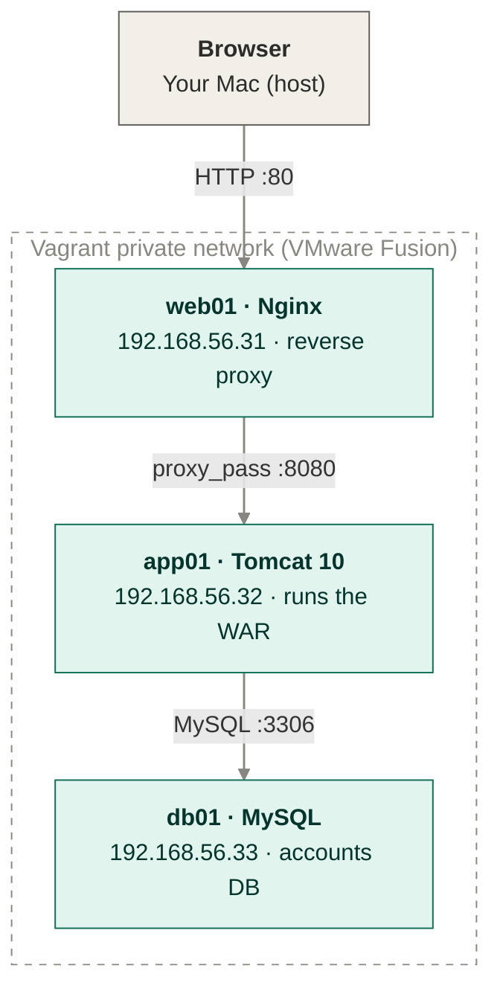
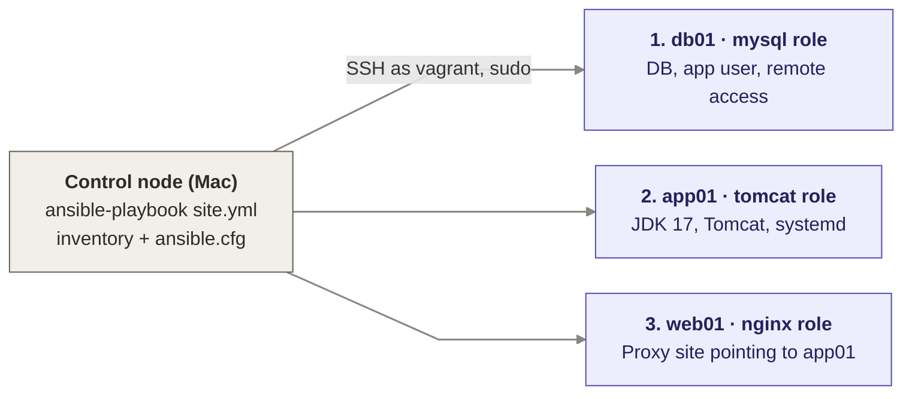

# ansible-multiter-deploy

100% local. No cloud account, no Terraform needed (that's Project 08).


## What's in here
A three-tier Java web stack (Nginx → Tomcat → MySQL) deployed across three virtual machines on your laptop, fully configured by Ansible. One command, `ansible-playbook site.yml`, takes three blank Ubuntu VMs to a working stack, and running it again changes nothing, because every task is idempotent. Secrets are kept out of Git and can be encrypted with Ansible Vault.

 Path | Purpose |
|---|---|
| `Vagrantfile` | Creates `web01`, `app01` and `db01` (Ubuntu 22.04 ARM64) on a private network |
| `ansible.cfg` | Points Ansible at the inventory and enables `sudo` for every task |
| `inventory/hosts` | Groups the VMs into `websrvgrp`, `appsrvgrp` and `dbsrvgrp` with their SSH keys |
| `site.yml` | Entry point: applies the roles in dependency order (database → app → web) |
| `roles/mysql` | Installs MySQL, creates the `accounts` database and app user, opens it to `app01` |
| `roles/tomcat` | Installs OpenJDK 17 and Tomcat 10 as a `systemd` service under a dedicated user, deploys an optional WAR |
| `roles/nginx` | Configures Nginx as a reverse proxy to `app01:8080`, with the target IP pulled from the inventory |
| `vars/secrets.example.yml` | Template for the database passwords (copy it to `vars/secrets.yml`, which is git-ignored) |

## Requirements

- VMWare Fusion installed
- Vagrant installed
- Ansible installed on your **host** machine (`pip install ansible --break-system-packages`
  or `brew install ansible` / `apt install ansible`)
- The `community.mysql` collection: `ansible-galaxy collection install community.mysql`

## Architecture
### Request flow (run time)



### Deployment flow (deploy time)


## Quick Start

## Project Layout
## Project layout

```
ansible-multitier-deploy/
├── Vagrantfile                  # 3-VM lab (VMware Fusion, Apple Silicon)
├── ansible.cfg                  # inventory path, remote user, sudo by default
├── site.yml                     # entry point: mysql → tomcat → nginx
├── .gitignore                   # keeps .vagrant/ and real secrets out of Git
├── inventory/
│   └── hosts                    # websrvgrp, appsrvgrp, dbsrvgrp + SSH keys
├── vars/
│   └── secrets.example.yml      # template for DB passwords (copy to secrets.yml)
└── roles/
    ├── mysql/                   # db01
    │   ├── tasks/main.yml       # install MySQL, create DB + app user, open 3306
    │   ├── handlers/main.yml    # restart mysql
    │   └── vars/main.yml        # db_name, db_user, db_backup_path
    ├── tomcat/                  # app01
    │   ├── tasks/main.yml       # OpenJDK 17, Tomcat 10, tomcat user, WAR deploy
    │   ├── handlers/main.yml    # restart tomcat
    │   ├── templates/
    │   │   └── tomcat.service.j2 # systemd unit
    │   └── vars/main.yml        # tomcat_version
    └── nginx/                   # web01
        ├── tasks/main.yml       # install Nginx, enable proxy site
        ├── handlers/main.yml    # reload nginx
        └── templates/
            └── vprofile.conf.j2 # reverse proxy to app01:8080
```
## Step 1 - Bring up the 3 VMs

```bash
vagrant up
```

This reads the `Vagrantfile` and creates `web01` (192.168.56.31), `app01` (192.168.56.32)
and `db01` (192.168.56.33) on a private VirtualBox network.

## Step 2 - ansible.cfg

Already in place at the project root. It points Ansible at `./inventory/hosts`,
disables host key checking (fine for throwaway local VMs), sets `remote_user = vagrant`,
and turns on `become` (sudo) by default so you don't need `-b` on every command.

## Step 3 - Inventory

`inventory/hosts` defines three groups - `[websrvgrp]`, `[appsrvgrp]`, `[dbsrvgrp]` -
each pointing at the matching VM's IP and Vagrant-generated SSH key.

> Note: Vagrant only creates `.vagrant/machines/<name>/virtualbox/private_key` **after**
> `vagrant up` has run for that VM, so do Step 1 before Step 4.

## Step 4 - Verify connectivity

```bash
ansible all -m ping
```

You should get a `SUCCESS` pong from `web01`, `app01`, and `db01`. If you get a
permission or key error, double-check the `ansible_ssh_private_key_file` paths in
`inventory/hosts` match where Vagrant actually put the keys (`vagrant ssh-config`
will show you).

## Step 5 - Roles

Already written under `roles/`:

- `roles/mysql` - installs MySQL, sets the root password, creates the `accounts`
  database and an app user, opens it to remote connections.
- `roles/tomcat` - installs OpenJDK 17, downloads & extracts Tomcat 10, creates a
  dedicated `tomcat` system user, and runs it as a systemd service.
- `roles/nginx` - installs Nginx and configures it as a reverse proxy to `app01:8080`.

### Configure secrets

Real credentials are not committed. Create your own from the template:

```bash
cp vars/secrets.example.yml vars/secrets.yml
# edit vars/secrets.yml and set your passwords
```

Optionally encrypt it with Ansible Vault:

```bash
ansible-vault encrypt vars/secrets.yml
ansible-playbook site.yml --ask-vault-pass
```

## Step 6 - site.yml

`site.yml` is the entry point: it applies the `mysql` role to `dbsrvgrp`, `tomcat` to
`appsrvgrp`, and `nginx` to `websrvgrp`, in that order.

```bash
ansible-playbook site.yml
```

The first run will take a few minutes (downloading packages + Tomcat).

## Step 7 - Idempotency check

```bash
ansible-playbook site.yml
```

Run it a **second** time. Every task should report `ok` (green) - nothing should show
as `changed` (yellow), because the desired state is already in place. This is the core
promise of configuration management: re-running is always safe.

If something does show `changed` on the second run, that's usually a sign a task isn't
properly idempotent (e.g. a `command`/`shell` task instead of a proper Ansible module) -
a good thing to debug as part of learning Ansible.

## Step 8 - Encrypt the secrets with Ansible Vault

Right now `vars/secrets.yml` is plaintext - fine for testing, not fine to commit to Git.

```bash
ansible-vault encrypt vars/secrets.yml
```

You'll be asked to set a vault password. From then on, run the playbook with:

```bash
ansible-playbook site.yml --ask-vault-pass
```

(or store the password in a file and use `--vault-password-file path/to/file`,
keeping that file itself out of Git via `.gitignore`).

To edit the encrypted file later: `ansible-vault edit vars/secrets.yml`.

## Deliverable checklist

- [x] `inventory/` + `ansible.cfg`
- [x] `roles/nginx`, `roles/tomcat`, `roles/mysql` - tasks, handlers, templates
- [x] `site.yml` deploying the full stack from zero
- [ ] Push this repo to Git/GitHub **after** vault-encrypting `vars/secrets.yml`

## Optional next step

Once `nginx` is up, visit `http://192.168.56.31` from your host browser - you should
see Nginx's proxy hit Tomcat's default landing page on `app01`. To deploy an actual
WAR file, set `war_file_path` (e.g. as an extra var: `-e war_file_path=/path/to/app.war`)
and re-run the playbook.


