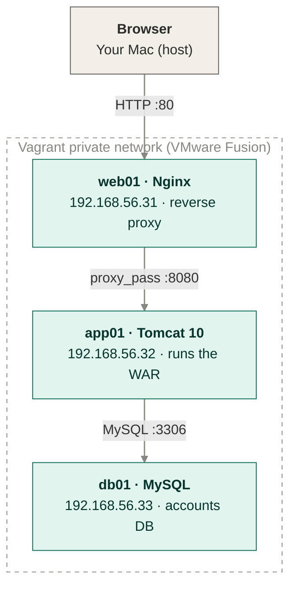
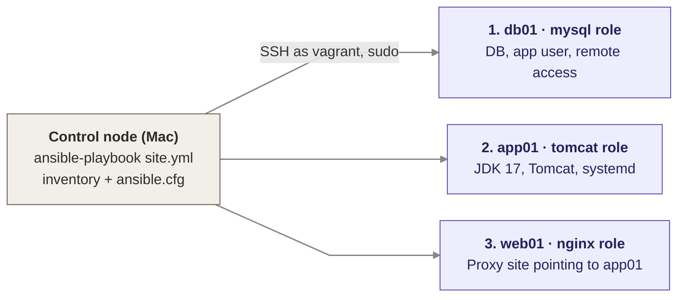

# ansible-multitier-deploy

> A 3-VM three-tier Java stack (Nginx → Tomcat → MySQL) configured end to end with Ansible.
> One playbook takes blank Ubuntu VMs to a working stack using reusable roles, handlers
> and templates, and re-runs safely with zero changes. Secrets stay out of Git.
> This project targets Apple Silicon Macs (M1/M2/M3/M4) using VMware Fusion.

[](./roles)
[](./Vagrantfile)
[](https://www.vagrantup.com/)
[](https://ubuntu.com/)
[](./LICENSE)

## What's in here
A three-tier Java web stack (Nginx → Tomcat → MySQL) deployed across three virtual machines on your laptop, fully configured by Ansible. One command, `ansible-playbook site.yml`, takes three blank Ubuntu VMs to a working stack, and running it again changes nothing, because every task is idempotent. Secrets are kept out of Git and can be encrypted with Ansible Vault.

## Requirements

- **macOS on Apple Silicon** (M1/M2/M3/M4)
- **VMware Fusion 13+**
- **Vagrant 2.4+**
- **`vagrant-vmware-desktop` plugin** + [Vagrant VMware Utility](https://developer.hashicorp.com/vagrant/install/vmware)
  (install the plugin with `vagrant plugin install vagrant-vmware-desktop`)
- **Ansible** on the host: `brew install ansible`
- **`community.mysql` collection**, included with the full `ansible` package; if missing:
  `ansible-galaxy collection install community.mysql`
- **~3 GB free RAM** for the VMs
- *Optional:* `vagrant-hostmanager` plugin, so VMs resolve each other by hostname
  (`vagrant plugin install vagrant-hostmanager`)

## Architecture
### Request flow (run time)



### Deployment flow (deploy time)


## Quick start

```bash
# 1. Clone the repo
git clone https://github.com/alexiglesias/ansible-multitier-deploy.git
cd ansible-multitier-deploy

# 2. Create your secrets file from the template and set your own passwords
cp vars/secrets.example.yml vars/secrets.yml

# 3. Bring up the 3 VMs in dependency order (db01 → app01 → web01)
vagrant up --no-parallel --provider=vmware_desktop

# 4. Verify Ansible can reach every VM (expect SUCCESS / pong from all three)
ansible all -m ping

# 5. Deploy the full stack
ansible-playbook site.yml

# 6. Open the application (Nginx → Tomcat landing page)
open http://192.168.56.31
```

The first run takes a few minutes while packages and Tomcat are downloaded.

## Idempotency check

Run the playbook a second time:

```bash
ansible-playbook site.yml
```

Every task should report `ok` and nothing `changed`, because the desired state
is already in place. Re-running is always safe:

```
PLAY RECAP *********************************************************
app01 : ok=..  changed=0  unreachable=0  failed=0  skipped=..
db01  : ok=..  changed=0  unreachable=0  failed=0  skipped=..
web01 : ok=..  changed=0  unreachable=0  failed=0  skipped=..
```

## Secrets and Ansible Vault

`vars/secrets.yml` is git-ignored, so real passwords never reach the repo.
To also protect it on disk, encrypt it with Ansible Vault:

```bash
ansible-vault encrypt vars/secrets.yml     # encrypt
ansible-playbook site.yml --ask-vault-pass # run with the vault password
ansible-vault edit vars/secrets.yml        # edit later
```

To avoid typing the password each time, store it in `.vault_pass` (also git-ignored)
and run `ansible-playbook site.yml --vault-password-file .vault_pass`.

## Deploying a WAR

By default Tomcat serves its landing page. To deploy your own application:

```bash
ansible-playbook site.yml -e war_file_path=/path/to/app.war
```

The `tomcat` role copies it to `webapps/ROOT.war` and restarts Tomcat.

## Troubleshooting

| Problem | Fix |
|---|---|
| `ansible all -m ping` fails with a key or permission error | Run `vagrant ssh-config` and check the key paths match `inventory/hosts` |
| `ping` fails right after `vagrant up` | Vagrant creates each VM's key only after it boots; make sure all three are running (`vagrant status`) |

## Stop / reset

```bash
vagrant halt              # stop the VMs, keep their state
vagrant destroy -f        # delete the VMs
vagrant up --no-parallel  # rebuild from zero, then re-run the playbook
```

## Project layout

```
ansible-multitier-deploy/
├── Vagrantfile                  # 3-VM lab (VMware Fusion, Apple Silicon)
├── ansible.cfg                  # inventory path, remote user, sudo by default
├── site.yml                     # entry point: mysql → tomcat → nginx
├── .gitignore                   # keeps .vagrant/ and real secrets out of Git
├── inventory/
│   └── hosts                    # websrvgrp, appsrvgrp, dbsrvgrp + SSH keys
├── vars/
│   └── secrets.example.yml      # template for DB passwords (copy to secrets.yml)
└── roles/
    ├── mysql/                   # db01
    │   ├── tasks/main.yml       # install MySQL, create DB + app user, open 3306
    │   ├── handlers/main.yml    # restart mysql
    │   └── vars/main.yml        # db_name, db_user, db_backup_path
    ├── tomcat/                  # app01
    │   ├── tasks/main.yml       # OpenJDK 17, Tomcat 10, tomcat user, WAR deploy
    │   ├── handlers/main.yml    # restart tomcat
    │   ├── templates/
    │   │   └── tomcat.service.j2 # systemd unit
    │   └── vars/main.yml        # tomcat_version
    └── nginx/                   # web01
        ├── tasks/main.yml       # install Nginx, enable proxy site
        ├── handlers/main.yml    # reload nginx
        └── templates/
            └── vprofile.conf.j2 # reverse proxy to app01:8080
```

## License

[MIT](./LICENSE)
